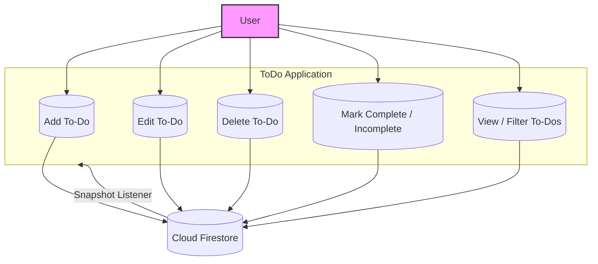
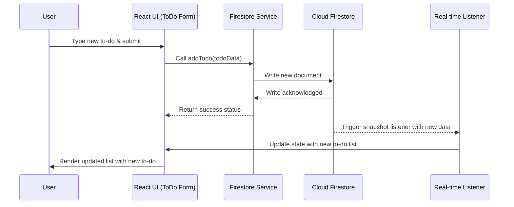

# To Do App
**To-Do** is a modern, responsive task management application built with React JS and Material UI, powered by Cloud Firestore for real-time data syncing. It enables users to add, edit, delete, and track to-do items effortlessly, ensuring a smooth device experience.

### Use-Case Diagram

The diagram below illustrates the main interactions in the **ToDo App** between the user, the application, and Cloud Firestore.  

### Sequence Diagram

### Technologies Used
- React JS
- Material UI
- Responsive Design
- Cloud Firestore 
- Firebase CLI 
- Firebase Hosting

Hosted URL -> [https://md-todo.web.app/](https://md-todo.web.app/)

### Editor/Author

[http://meghnathdas.github.io/](http://meghnathdas.github.io/)
