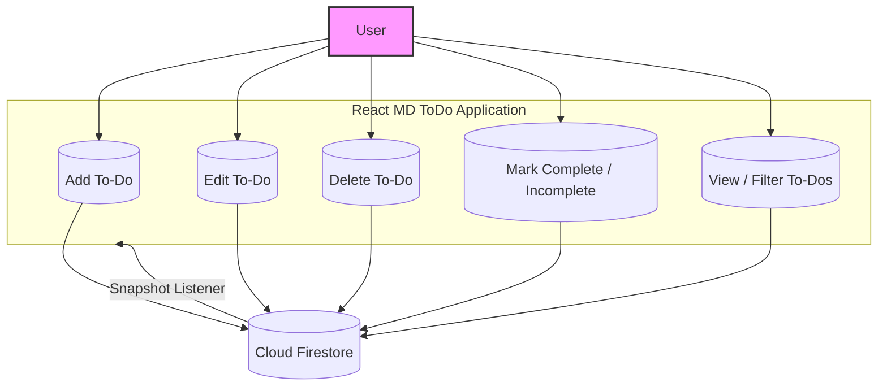

# To Do App
###### Author: Meghnath Das

### Technologies Used
- React JS
- Material UI
- Responsive Design
- Cloud Firestore 
- Firebase CLI 
- Firebase Hosting

Hosted URL -> [https://md-todo.web.app/](https://md-todo.web.app/)

# Editor

[http://meghnathdas.github.io/](http://meghnathdas.github.io/)

---

## Use-Case Diagram

The diagram below illustrates the main interactions in the **React MD ToDo App** between the user, the application, and Cloud Firestore.  

